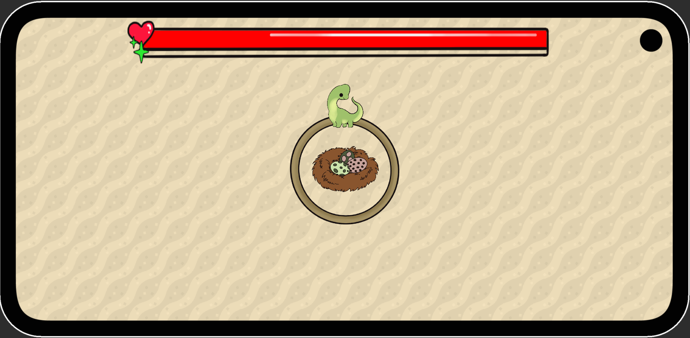
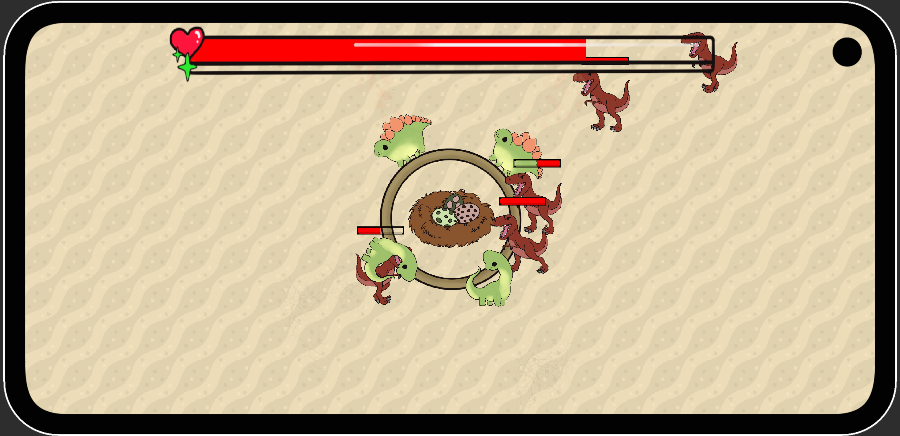
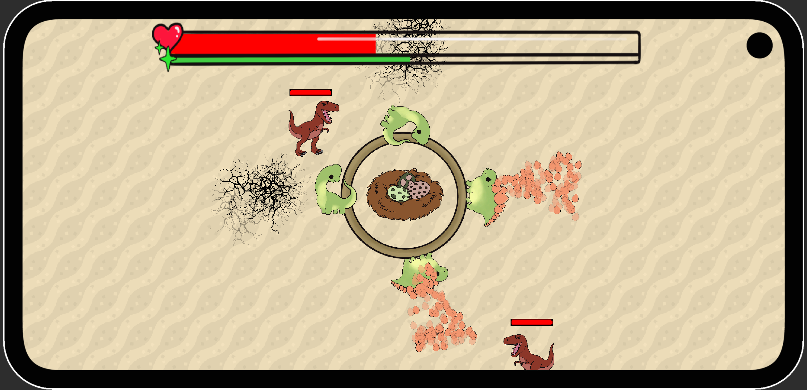
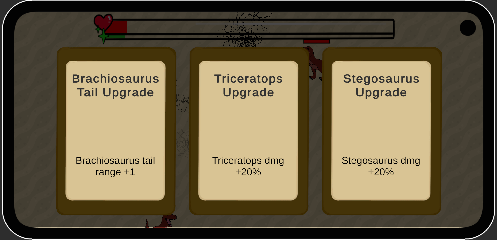

# Defendino

*As a herd of herbivore dinos, you've become an easy target for a rival tribe of carnivores. They won't stop until they get what they want - **your precious, tasty eggs**.*

In ***Defendino*** you are **never safe** - you will need to adapt and survive the onslaught for as long as you can. The longer you persevere, the more **upgrades** will be accessible to you - from simple upgrades that allow you to repel the invaders more efficiently, to even **additional dinos** and upgrades to their offensive abilities. **Each run is different**, as the selection of upgrades and enemies waves are unique to each run.

***Defendino*** is an **endless** game - your skills and game knowledge are the only things holding you back from achieving high scores and glory. The longer you play, the longer you will be able to survive - your **skills and knowledge** are the only things holding you back from achieving high scores and glory. Compete in **global** and **friend-based leaderboards** to claim the first place (and earn those bragging rights ?).

Are you up to the challenge?
 
## Motivation
Defendino was created at [Hackyeah](https://hackyeah.pl/) Hackathon in Gamedev category from GGBay.

- **Topic:** Dinosaurs

- Timeframe: 30 September - 01 October 2023, 24 hours

## Tech Stack

 
 

## Screenshots

## Authors

### Graphics

- [@Drizzt-sama](https://github.com/Drizzt-sama)

### Programming

- [@BPajda](https://github.com/BPajda)
- [@MBrosik](https://github.com/MBrosik)
- [@MSiorr](https://github.com/MSiorr)
- [@rubikon02](https://github.com/rubikon02)
- [@spookyless](https://github.com/spookyless)

## Used assets

Background sand tiles by [Kenney](https://kenney.nl/assets/map-pack)

## License

This project is licensed under [MIT](./LICENSE) license.
